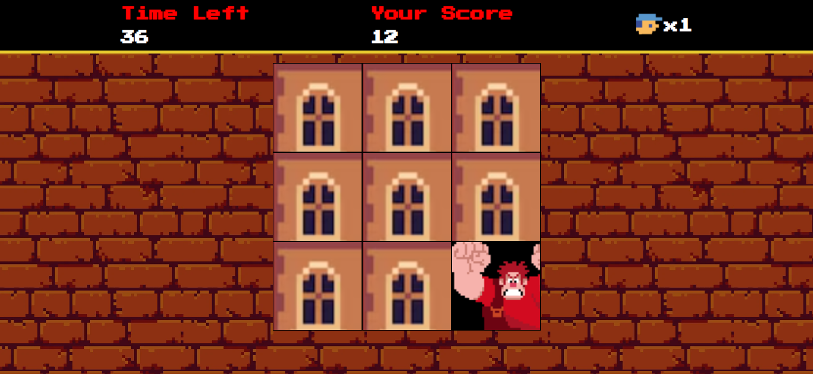

## 💥 DETONA RALPH GAME

<div align="center">
  
  
  
  
  
  
  **Um jogo interativo inspirado no clássico Detona Ralph com mecânicas avançadas e sistema de ranking!**
</div>

---

## 🌟 Sobre o Projeto

Este projeto foi desenvolvido como parte do bootcamp da [DIO](https://www.dio.me/), mas evoluiu muito além do escopo original!

### 🎯 Objetivo do Jogo
Acerte Ralph nas janelas que aparecem aleatoriamente. Quanto mais você joga, mais rápido ele fica. Consegue sobreviver aos 60 segundos e entrar no hall da fama?

---

## ✨ Funcionalidades Principais

- **Hall da Fama**: Top 3 melhores pontuações salvas permanentemente
- **Nomes Personalizados**: Registre seu nome quando fizer um novo recorde
- **Armazenamento Local**: Suas conquistas ficam salvas no navegador

### 💾 Sistema de Backup
- **Export de Placar**: Salve seus recordes em arquivo JSON
- **Import de Placar**: Restaure recordes de arquivos salvos
- **Portabilidade Total**: Leve seus recordes para qualquer lugar

### 🚀 Dificuldade Aumentada 🎮

- **Velocidade Dinâmica**: A cada 5 pontos, o Ralph fica mais rápido

### 🎮 Interface
- **Tela de Menu**: Interface elegante com ranking dos melhores
- **Tela de Game Over**: Resultados detalhados e opções de restart
- **Design Responsivo**: Funciona perfeitamente em desktop e mobile

### ⚡ Mecânicas de Jogo
- **Sistema de Vidas**: 3 vidas
- **Tempo Limitado**: 60 segundos
- **Controles Intuitivos**: Mouse no desktop, touch no mobile

---

## 🛠️ Tecnologias e Arquitetura

### Frontend
- **HTML5**,**CSS3**,**JavaScript**

### Recursos Técnicos
- **LocalStorage API**: Persistência de dados do ranking
- **File API & Blob**: Sistema completo de export/import
- **JSON Validation**: Validação de arquivos de backup
- **Web Audio API**: Sistema de sons sincronizados
- **CSS Grid/Flexbox**: Layout responsivo e moderno

## � Sistema de Backup do Placar

### 📥 **Exportar Recordes**
```
1. Na tela inicial, clique em "📥 EXPORTAR"
2. Arquivo JSON será baixado automaticamente
3. Salve o arquivo em local seguro (Dropbox, Drive, etc.)
```

### 📤 **Importar Recordes**
```
1. Na tela inicial, clique em "📤 IMPORTAR"
2. Selecione seu arquivo de backup (.json)
3. Confirme a importação dos recordes
```

### 🗑️ **Resetar Placar**
```
1. Na tela inicial, clique em "🗑️ RESETAR"
2. Confirme DUAS vezes (ação irreversível!)
3. Placar zerado para novos desafios
```

## �🚀 Como Executar

### Opção 1: GitHub Pages
Acesse diretamente: [**JOGAR AGORA**](https://spyhenry.github.io/Detona-Ralph-Game/)

### Opção 2: Local
```bash
# Clone o repositório
git clone https://github.com/SpyHenry/Jogo-do-Detona-Ralph.git

# Entre na pasta
cd Jogo-do-Detona-Ralph

# Abra o index.html no seu navegador preferido
```

## 🎵 Áudios Necessários

Para a experiência completa, adicione estes arquivos na pasta `src/audios/`:
- `coin.mp3` - Som de acerto ✅
- `error.mp3` - Som de erro ❌  
- `win.mp3` - Som de vitória 🏆
- `gameover.mp3` - Som de game over 💀
- `speedup.mp3` - Som de aumento de velocidade 🚀
- `countdown.mp3` - Som dos últimos 5 segundos ⏰

---

## 📞 Contato

Este projeto foi desenvolvido com muito carinho e dedicação!

**Henrique Baptista Bandeira**  
[](https://www.linkedin.com/in/henrique-baptista-bandeira)
[](https://github.com/SpyHenry)

---

<div align="center">  
  **⭐ Se você gostou do projeto, não esqueça de dar uma estrela no repositório! ⭐**
</div>


